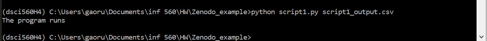

# Random number generator
This is a repository for testing figshare and zenodo. It contains script1.py which generates 1000 random integers between 0-100, script2.py which passes the original dataset from script1.py througth a linear transformation y = 3x+6, and script3.py which plots the transformed data against the orignal data. 

# Reproducibility  
## create a virtual environment  
* locate to the local directory that contains the random generator scripts. (1)
* `pip install virtualenv` to install virtualenv package  (1)
* `py -m venv dsci560H4 ` to start a virtual environment where dsci560H4 is the name of your environment  (1)
* `.\dsci560H4\Scripts\activate` to start the virtual environment (1)
* `pip install numpy, matplotlib, pandas` to install the necessary dependencies to fun the random number generator scripts  (2)
* `python script1.py script1_output.csv` to run random number generator  (3)
* `pip freeze > requirements.txt` to save the dependencies in requirements.txt file  (4)

## Binder link  (5)

## Comparison between dependencies listed and package manually installed  (4)  
I have manually installed numpy, pandas, and jupyter notebook as these are the required packages I need for executing my program in my virtual environment. Comparing with the requirements.txt file extracted by running pip freeze, I found that there are actually much more dependencies installed than what I have manully typed in. This is because the package I installed such as numpy, requires many dependencies, thus these dependencies will have to be intalled first before numpy which results in this long list of packages.  
